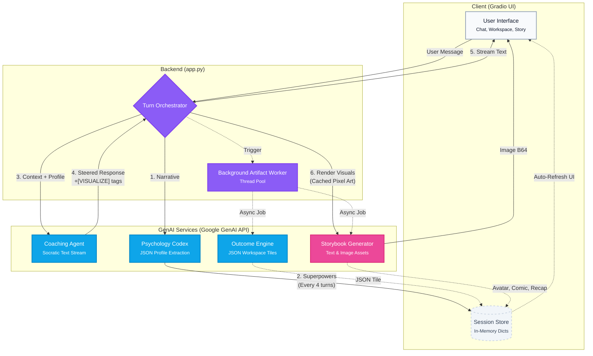

# ArcMotivate Architecture

```mermaid
graph TD
    %% Styling
    classDef client fill:#f8fafc,stroke:#94a3b8,stroke-width:2px,color:#0f172a
    classDef core fill:#8b5cf6,stroke:#7c3aed,stroke-width:2px,color:#fff
    classDef llm fill:#0ea5e9,stroke:#0284c7,stroke-width:2px,color:#fff
    classDef img fill:#ec4899,stroke:#db2777,stroke-width:2px,color:#fff
    classDef data fill:#f1f5f9,stroke:#cbd5e1,stroke-width:2px,stroke-dasharray: 5 5,color:#334155

    %% Client Layer
    subgraph Client ["Client (Gradio UI)"]
        UI[User Interface<br/><small>Chat, Workspace, Story</small>]:::client
        State[(Session Store<br/><small>In-Memory Dicts</small>)]:::data
    end

    %% Application Core
    subgraph Backend ["Backend (app.py)"]
        Orchestrator{Turn Orchestrator}:::core
        Worker[Background Artifact Worker<br/><small>Thread Pool</small>]:::core
    end

    %% Cognitive Modules
    subgraph GenAI ["GenAI Services (Google GenAI API)"]
        Agent[Coaching Agent<br/><small>Socratic Text Stream</small>]:::llm
        Codex[Psychology Codex<br/><small>JSON Profile Extraction</small>]:::llm
        Tiles[Outcome Engine<br/><small>JSON Workspace Tiles</small>]:::llm
        Story[Storybook Generator<br/><small>Text & Image Assets</small>]:::img
    end

    %% Flow
    UI -- "User Message" --> Orchestrator
    
    %% Main Path
    Orchestrator -- "1. Narrative" --> Codex
    Codex -- "2. Superpowers<br/>(Every 4 turns)" --> State
    Orchestrator -- "3. Context + Profile" --> Agent
    Agent -- "4. Steered Response<br/>+[VISUALIZE] tags" --> Orchestrator
    
    %% Render Path
    Orchestrator -- "5. Stream Text" --> UI
    Orchestrator -- "6. Render Visuals<br/>(Cached Pixel Art)" --> Story
    Story -- "Image B64" --> UI
    
    %% Artifact Path
    Orchestrator -. "Trigger" .-> Worker
    Worker -. "Async Job" .-> Tiles
    Worker -. "Async Job" .-> Story
    Tiles -. "JSON Tile" .-> State
    Story -. "Avatar, Comic, Recap" .-> State
    
    State -. "Auto-Refresh UI" .-> UI
```
